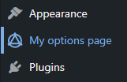
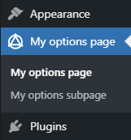
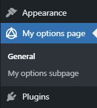

# Configuration

Make sure you have Alchemy Options [installed](installation.md).

## Creating option pages

To create an Alchemy Options option page use the `alch_options_pages` hook:

```php
function add_custom_options_pages( $pages ) {
    $myPages = array(
        array(
            'id' => 'my-options-page',
            'name' => 'My options page',
        )
    );

    return array_merge( $pages, $myPages );
}

add_filter( 'alch_options_pages', 'add_custom_options_pages' );
```

This will add an options page to the WordPress sidebar.



By default, top-level pages are added after the Appearance section, but you can filter the page [position](filters/alch_default_page_position.md), as well as its [capabilities](filters/alch_default_page_capabilities.md) and [icon](filters/alch_default_page_icon.md) via respective hooks.

## Creating option pages with subpages

An Alchemy Options option page can have subpages, you can specify them in the `subpages` array like so:

```php
function add_custom_options_pages( $pages ) {
    $myPages = array(
        array(
            'id' => 'my-options-page',
            'name' => 'My options page',
            'subpages' => array(
                array(
                    'id' => 'my-options-subpage',
                    'name' => 'My options subpage',
                ),
            ),
        )
    );

    return array_merge( $pages, $myPages );
}

add_filter( 'alch_options_pages', 'add_custom_options_pages' );
```

This adds an options page with a subpage to the WordPress sidebar.



By default, the top-level page gets duplicated as a subpage producing 2 identical page titles. You can modify them like so:

```php
function add_custom_options_pages( $pages ) {
    $myPages = array(
        array(
            'id' => 'my-options-page',
            'name' => 'My options page',
            'subpages' => array(
                array(
                    'id' => 'my-options-page',
                    'name' => 'General',
                ),
                array(
                    'id' => 'my-options-subpage',
                    'name' => 'My options subpage',
                ),
            ),
        )
    );

    return array_merge( $pages, $myPages );
}

add_filter( 'alch_options_pages', 'add_custom_options_pages' );
```

This will produce nicer page names without title duplication.



Notice that in order for it to work the top-level and subpage `id`s should be the same.

## Adding options to option pages

To add options to Alchemy Options option pages use the `alch_options` hook:

```php
function add_custom_options( $options ) {
    $myOptions = array(
        /* options will go here */
    );

    return array_merge( $options, $myOptions );
}

add_filter( 'alch_options', 'add_custom_options' );
```

That's it, just add [some options](fields/) instead of `/* options will go here */` and see them appear on the page.

## Grouping

If there's a need to split options into several groups, Alchemy Options has got you covered. You may add the `tabs` section to the config that looks like this:

```php
...
'tabs' => array(
    'tab-one-id' => array(
        'title' => 'Tab one'
    ),
    'tab-two-id' => array(
        'title' => 'Tab two'
    ),
)
...
```

Keys of the `tabs` array should be unique, these values will be used in configuring of each option with the `tab` key. If no `tab` key is found in each option's settings it will be rendered in each tab.

Thus, the `$options` variable from above will look like this:

```php
...
$options = array(
    'tabs' => array(
        'tab-one-id' => array(
            'title' => 'Tab one'
        ),
        'tab-two-id' => array(
            'title' => 'Tab two'
        ),
    ),
    'options' => array(
      /* options will go here */
    )
);
...
```

If there's a need to split options even further, there's a [`sections`](fields/sections.md) type for visual splitting of fields into togglable sections and a [`field-group`](fields/field-group.md) type to group related fields together for an easier [value retrieval](functions/alch_get_option.md).
