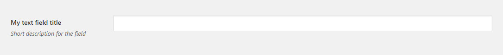

# Text Field

Text field renders a simple text input.
 
## Example configuration

```php
...
array(
    'title' => 'My text field title',
    'id' => 'text-option',
    'desc' => 'Short description for the field',
    'tab' => 'main',
    'type' => 'text',
),
...
```

This will produce the following


## Params

