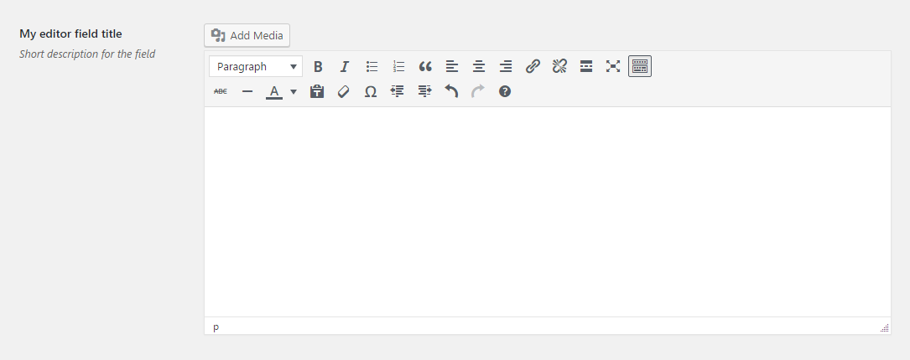

# Editor Field

Editor field renders a WYSIWYG editor. Due to complexities of the field, it does not have the switch between Text and Visual modes.
 
## Example configuration

```php
...
array(
    'title' => 'My editor field title',
    'id' => 'editor-option',
    'desc' => 'Short description for the field',
    'tab' => 'main',
    'type' => 'editor',
),
...
```

This will produce something similar to the following



In other words it will look like a WYSIWYG editor from the post page.

## Filters

The field uses [`wp_kses`](https://developer.wordpress.org/reference/functions/wp_kses/) to sanitize the value before storing it in the database. The following filters can be used to control it.

| Name | Description |
| --- | --- |
| `alch_allowed_editor_html_tags` | Can be used to control which HTML tags are allowed.
| `alch_allowed_editor_protocols` | Can be used to control which protocols are allowed.

See the filters page for more details.

## Params

| Name | Description |
| --- | --- |
| `type` | `editor` **(required)**
| `id` | Unique ID that will be used to retrieve the value **(required)**
| `tab` | Specifies in which tab this option will be rendered
| `title` | Shows a heading to the left of the field
| `desc` | Shows a description text (can have HTML)