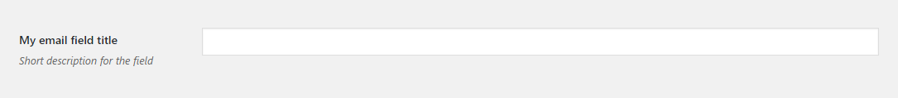

# Email Field

Email field renders a text input. Uses the native `input[type="email"]`. Native client-side validation.
 
## Example configuration

```php
...
array(
    'title' => 'My email field title',
    'id' => 'email-option',
    'desc' => 'Short description for the field',
    'tab' => 'main',
    'type' => 'email',
),
...
```

This will produce the following



## Params

| Name | Description |
| --- | --- |
| `type` | `email` **(required)**
| `id` | Unique ID that will be used to retrieve the value **(required)**
| `tab` | Specifies in which tab this option will be rendered
| `title` | Shows a heading to the left of the field
| `desc` | Shows a description text (can have HTML)