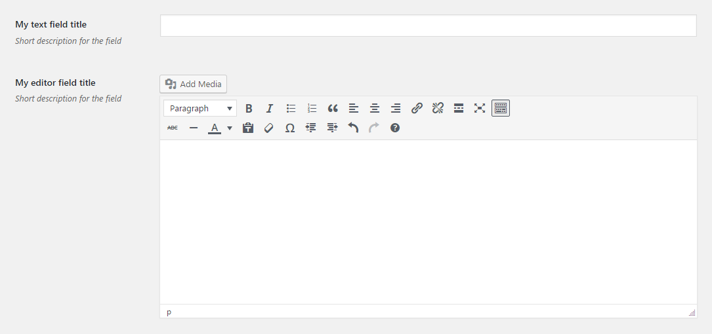

# Field Group

Field group renders fields as a... well... group. Visually it is the same as adding them separately. See a more detailed [description](#description) if the benefits are not clear.
 
## Example configuration

```php
...
array(
    'id' => 'field-group-option',
    'tab' => 'main',
    'type' => 'field-group',
    'fields' => array(
        array(
            'title' => 'My text field title',
            'desc' => 'Short description for the field',
            'id' => 'title',
            'type' => 'text',
        ),
        array(
            'title' => 'My editor field title',
            'desc' => 'Short description for the field',
            'id' => 'content',
            'type' => 'editor',
        ),
    ),
),
...
```

This will produce the following



## Description

A Field Group is useful when you'd like to group related fields and retrieve them as one complex value. The `fields` array contains regular fields configurations.

The `id` field for the fields in a group should not necessarily be unique, in fact, it's much nicer when it is simple. See the [configuration example](#example-configuration) where the fields have such IDs as `title` and `content`. If there's another `field-group` on the page, it's OK to reuse `title` and `content` as IDs in its `fields` array too. One just needs to make sure that the ID of the `field-group` itself is unique.

The fields IDs will be the keys of the associative array that is [returned](#return-value) when the value is requested.

## Params

| Name | Type | Description |
| --- | --- | --- |
| `type` | string | `field-group` **(required)**
| `id` | string | Unique ID that will be used to retrieve the value **(required)**
| `fields` | array | Array of fields usual configurations. See a more detailed [description](#description). **(required)**
| `tab` | string | Specifies in which tab this option will be rendered

## Return value

The Field Group returns an associative array, where array keys are the IDs of the `fields` array items. E.g. the [configuration example](#example-configuration) above may return

```php
array(
    'title' => 'Lorem ipsum',
    'content' => 'Dolor sit',
),
```

The `default` parameter of the `alch_get_option()` will be returned if **all** of the fields in the group return a default value, otherwise the value array will contain only those fields that have values. In the example above it will be possible for the return value to be

```php
array(
    'content' => 'Dolor sit',
),
```

if a user hasn't filled in the `title` field.