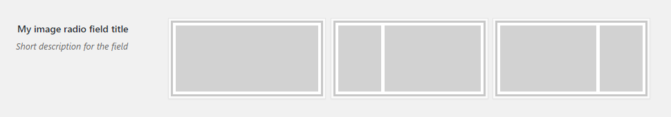
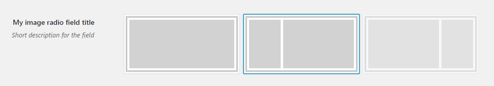

# Image Radio Field

Image radio field renders a set of radio buttons with images as labels. Supports initial [`checked` or `disabled` attributes](#checked-and-disabled).
 
## Example configuration

```php
...
array(
    'title' => 'My image radio field title',
    'id' => 'image-radio-option',
    'desc' => 'Short description for the field',
    'tab' => 'main',
    'type' => 'radio',
    'choices' => array(
        array(
            'value' => 'First val',
            'image' => 'path/to/image-one.png',
        ),
        array(
            'value' => 'Second val',
            'image' => 'path/to/image-two.png',
        ),
        array(
            'value' => 'Third val',
            'image' => 'path/to/image-three.png',
        ),
    ),
),
...
```

This will produce the following



## `checked` and `disabled`

If `checked` or `disabled` keys are specified, they'll be respected. E.g:

```php
'choices' => array(
    array(
        'value' => 'First val',
        'image' => 'path/to/image-one.png',
    ),
    array(
        'value' => 'Second val',
        'image' => 'path/to/image-two.png',
        'checked' => true,
    ),
    array(
        'value' => 'Third val',
        'image' => 'path/to/image-three.png',
        'disabled' => true,
    ),
)
```

will result in the following



Notice that the second option is checked on initial page load and the third option is not checkable.

## Params

| Name | Type | Description |
| --- | --- | --- |
| `type` | string | `radio` **(required)**
| `id` | string | Unique ID that will be used to retrieve the value **(required)**
| `tab` | string | Specifies in which tab this option will be rendered
| `title` | string | Shows a heading to the left of the field
| `desc` | string | Shows a description text (can have HTML)
| `choices` | array | Kind of required, but will not render anything if no choices are provided. Must be an array of arrays with `value` and `image` keys. See [examples](#example-configuration) above.