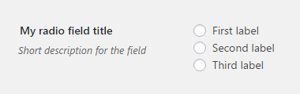
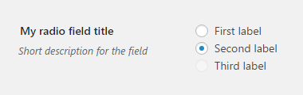

# Radio Field

Radio field renders a set of radio buttons. Supports initial [`checked` or `disabled` attributes](#checked-and-disabled).
 
## Example configuration

```php
...
array(
    'title' => 'My radio field title',
    'id' => 'radio-option',
    'desc' => 'Short description for the field',
    'tab' => 'main',
    'type' => 'radio',
    'choices' => ['First label', 'Second label', 'Third label']
),
...
```

This will produce the following



It will use the label text as the value. If you wish to separate values from labels use the following syntax for the `choices` key:

```php
...
'choices' => array(
    array(
        'value' => 'First value',
        'label' => 'First label',
    ),
    array(
        'value' => 'Second value',
        'label' => 'Second label',
    ),
    array(
        'value' => 'Third value',
        'label' => 'Third label',
    ),
)
...
```

## `checked` and `disabled`

If `checked` or `disabled` keys are specified, they'll be respected. E.g:

```php
...
'choices' => array(
    array(
        'value' => 'First value',
        'label' => 'First label',
    ),
    array(
        'value' => 'Second value',
        'label' => 'Second label',
        'checked' => true,
    ),
    array(
        'value' => 'Third value',
        'label' => 'Third label',
        'disabled' => true,
    ),
)
...
```

will result in the following



Notice that the second option is checked on initial page load and the third option is not checkable.

## Params

| Name | Type | Description |
| --- | --- | --- |
| `type` | string | `radio` **(required)**
| `id` | string | Unique ID that will be used to retrieve the value **(required)**
| `tab` | string | Specifies in which tab this option will be rendered
| `title` | string | Shows a heading to the left of the field
| `desc` | string | Shows a description text (can have HTML)
| `choices` | array | Kind of required, but will not render anything if no radio choices are provided. Can be an array of strings or an array of arrays with `value` and `label` keys. See [examples](#example-configuration) above.