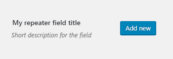
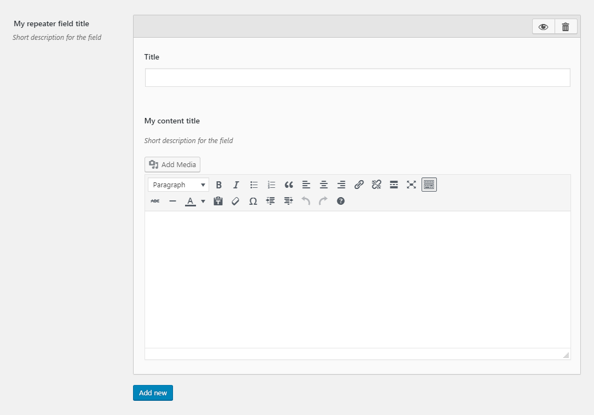
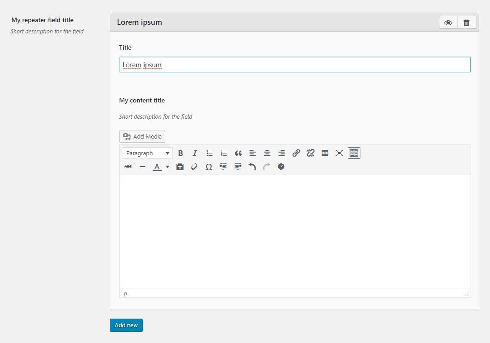
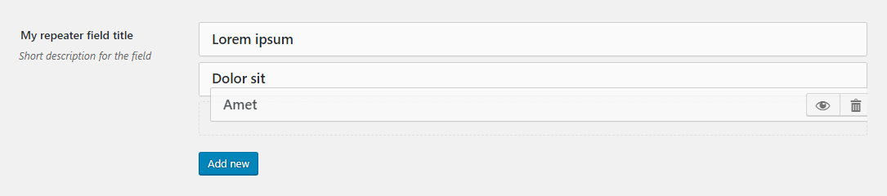
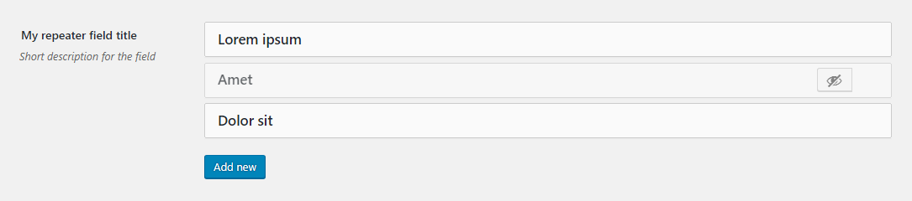
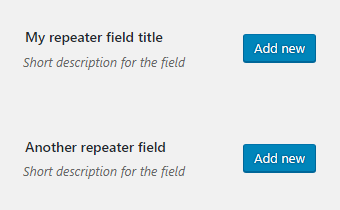
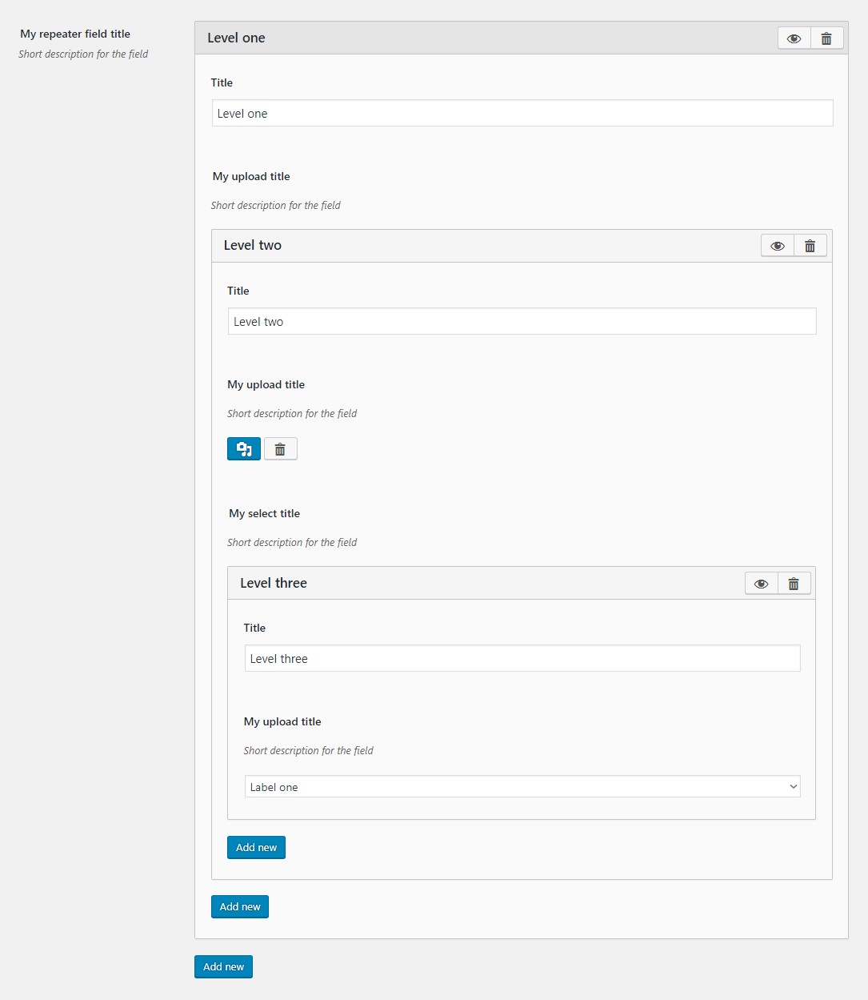
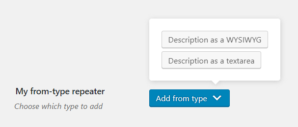
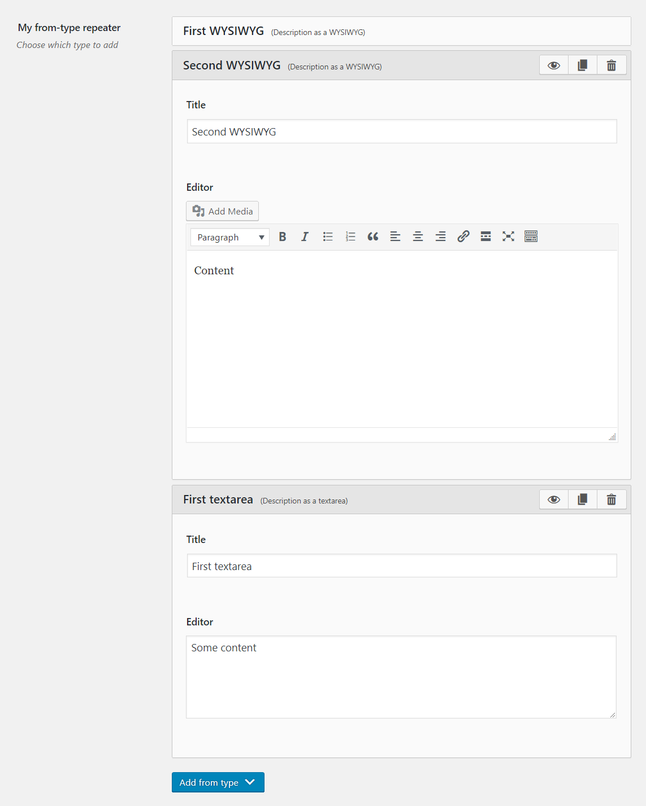

# Repeater Field

Repeater field is one of the most powerful Alchemy Options fields. Alongside the [Sections](sections.md) and [Field Group](field-group.md) fields it groups fields and allows to [produce arrays of values](#return-value).

## Features:

* Can be [sorted by drag-and-drop](#sorting).
* Can [temporarily remove values](#temporary-hiding) from the front end.
* Can [copy items](#copying-a-repeatee).
* Can repeat items of [different types](#typed-repeaters).
 
2 things were taken as the pillars of a repeater:

1. [Reusability](#reusing-the-repeaters-signature) of a repeater's signature (both in Options and [Meta Boxes](../Meta-boxes.md)
2. Possibility to [nest repeaters](#nested-repeaters) into one another

Thus a repeater field consists of 2 parts: a) the field itself and b) its signature (like a mould for the field).

## Repeater signatures

All repeater signatures should be specified in their own config in the `admin_init` callback. Like so:

```php
function add_careers_repeaters() {
    if ( ! function_exists( 'alch_repeaters_id' ) || ! is_admin() ) {
        return;
    }

    $saved_settings = get_option( alch_repeaters_id(), array() );

    $custom_settings = array(
        array(
            'id' => 'repeater-one',
            'fields' => array(
                array(
                    'title' => 'My content title',
                    'desc' => 'Short description for the field',
                    'id' => 'description',
                    'type' => 'editor',
                ),
            ),
        ),
    );

    $custom_settings = apply_filters( alch_repeaters_id() . '_args', $custom_settings );

    if ( $saved_settings !== $custom_settings ) {
        update_option( alch_repeaters_id(), $custom_settings );
    }
}

add_action( 'admin_init', 'add_careers_repeaters' );
```

Each signature is an array with [`id` and `fields` keys](#signature-params). Much like the [Field Group](field-group.md) field.

The fields themselves are added just like any other fields in the `options` part of the main config with one exception - the type of the field should be in the following format: `repeater:signatureID`.

Since the [Sections](sections.md) field is primarily for aesthetic grouping, it cannot be used within the Repeater.

Enough talking, let's see some code :)
 
## Example configuration

Considering we have the [signatures](#repeater-signatures) as above.

```php
...
'options' => array(
    array(
        'title' => 'My repeater field title',
        'id' => 'repeater-field',
        'desc' => 'Short description for the field',
        'type' => 'repeater:repeater-one',
        'tab' => 'homepage',
    ),
),
...
```

This will produce the following



Doesn't look like much unless you click the `Add new` button which will result in the following



Thus pressing the `Add new` button again and again will generate as many items (a.k.a. 'repeatees') as needed.

Note that although I've specified one field in the configuration above (which is the [Editor field](editor.md)) **2** of them are present on the screenshot. The `title` field is there by default and will show the value in the title bar of the repeatee as soon as you type something in. Repeatees would have been harder to distinguish if they weren't 'labeled'.



## Sorting

Single click on the toolbar will toggle the visibility of the item, while click and drag will allow to sort



You can sort 'closed' items or 'open' it doesn't matter. 

## Temporary hiding

If you hover over or expand a repeatee there's a button group that allows to delete or to temporarily hide it. If you press the `Hide` button, the repeatee's value will not be included in the return value and the item itself will indicate that it's hidden.



## Copying a repeatee

If you press the Copy button, it'll work as expected and will produce an exact copy of the repeatee below it. If the target repeatee is hidden, the resulted copy will be hidden as well.

## Reusing a repeater's signature

Since repeaters' signatures are defined in their own config it allows developers to reuse a repeater's signature to create several repeater fields.

E.g. the following configuration

```php
...
'options' => array(
    array(
        'title' => 'My repeater field title',
        'id' => 'repeater-field',
        'desc' => 'Short description for the field',
        'type' => 'repeater:my-repeater',
        'tab' => 'homepage',
    ),
    array(
        'title' => 'Another repeater field',
        'id' => 'repeater-field-two',
        'desc' => 'Short description for the field',
        'type' => 'repeater:my-repeater',
        'tab' => 'homepage',
    ),
),
...
```

will create two separate repeater fields with identical fields using the same signature



## Nested repeaters

You can nest repeaters, make sure that the repeaters' signatures are not nested. Here's an example of a repeater inside a repeater inside a repeater (that's right - 3 levels deep)

### Repeaters signatures:

```php
    array(
        'id' => 'my-repeater',
        'fields' => array(
            array(
                'title' => 'My upload title',
                'id' => 'upload',
                'desc' => 'Short description for the field',
                'type' => 'repeater:upload-repeater',
            ),
        ),
    ),
    array(
        'id' => 'upload-repeater',
        'fields' => array(
            array(
                'title' => 'My upload title',
                'desc' => 'Short description for the field',
                'id' => 'upload',
                'type' => 'upload',
            ),
            array(
                'title' => 'My select title',
                'id' => 'checks',
                'desc' => 'Short description for the field',
                'type' => 'repeater:select-repeater',
            ),
        ),
    ),
    array(
        'id' => 'select-repeater',
        'fields' => array(
            array(
                'title' => 'My upload title',
                'desc' => 'Short description for the field',
                'id' => 'select',
                'type' => 'select',
                'choices' => ['Label one', 'Label two', 'Label three']
            ),
        ),
    ),
```

### Options:

```php
...
'options' => array(
    array(
        'title' => 'My repeater field title',
        'id' => 'repeater-field',
        'desc' => 'Short description for the field',
        'type' => 'repeater:my-repeater',
        'tab' => 'homepage',
    ),
),
...
```



Note that all 3 different signatures are top level (not nested) but the `fields` part reference them. Thus creating the needed nesting.

## Typed repeaters

A repeater field can repeat values of different types. It has a slightly different config signature that has `field-types` instead of `fields` in it. Each `field-type` should have a unique `id`, nice `title` (that will be seen on the front end) and the `fields` key that has regular options settings. E.g.

### Repeaters signatures:

```php
array(
    'id' => 'my-repeater',
    'field-types' => array(
        array(
            'id' => 'wysiwyg',
            'title' => 'Description as a WYSIWYG',
            'fields' => array(
                array(
                    'title' => 'Editor',
                    'id' => 'editor',
                    'type' => 'editor',
                ),
            ),
        ),
        array(
            'id' => 'textarea',
            'title' => 'Description as a textarea',
            'fields' => array(
                array(
                    'title' => 'Editor',
                    'id' => 'editor',
                    'type' => 'textarea',
                ),
            ),
        ),
    ),
),
```

### Options:

```php
array(
    'title' => __( 'My from-type repeater', 'dotmailer' ),
    'desc' => __( 'Choose which type to add', 'dotmailer' ),
    'id' => 'from-type-repeater',
    'type' => 'repeater:my-repeater',
),
```

These settings will produce the following:



Clicking any of the types will produce repeatees of the respective type. Since it's a repeater field you can mix and match repeatees of various types under one option ID.



Kinda nice, huh? :)

## Params

| Name | Type | Description |
| --- | --- | --- |
| `type` | string | `repeater:signatureID`. [Signature ID](#repeater-signatures) should match one from the repeaters config. **(required)**
| `id` | string | Unique ID that will be used to retrieve the value **(required)**
| `tab` | string | Specifies in which tab this option will be rendered
| `title` | string | Shows a heading to the left of the field
| `desc` | string | Shows a description text (can have HTML)

## Simple signature params

| Name | Type | Description |
| --- | --- | --- |
| `id` | string | Unique ID that will be used in the `type` parameter of the field **(required)**
| `fields` | array | Array of fields usual configurations. Can have [nested repeater fields](#nested-repeaters). Ignores the [Sections](sections.md) field. **(required)**

## Typed repeater signature params

| Name | Type | Description |
| --- | --- | --- |
| `id` | string | Unique ID that will be used in the `type` parameter of the field **(required)**
| `field-types` | array | Configurations for each repeatee type, which is an array consisting of the required `id`, `title` and `fields` keys. See [an example](#typed-repeaters) above. **(required)**

## Return value

Repeater field returns an array of associative arrays where array keys are the signature's fields IDs. The results will not include the [hidden repeatees](#temporary-hiding).

A nested sample config above may return something as follows:

```php
Array
(
    [0] => Array
        (
            [title] => Level one
            [upload] => Array
                (
                    [0] => Array
                        (
                            [title] => Level two
                            [upload] =>
                            [checks] => Array
                                (
                                    [0] => Array
                                        (
                                            [title] => Level three
                                            [select] => Label one
                                        )
                                )
                        )
                )
        )
    [1] => Array
        (
            [title] => Another field
            [upload] => Array
                (
                )
        )
)
```

## Typed repeaters return value

Typed arrays return an array with `type` and `value` fields, `type` is the field type ID you specified in the settings and `value` is a regular repeater return value.