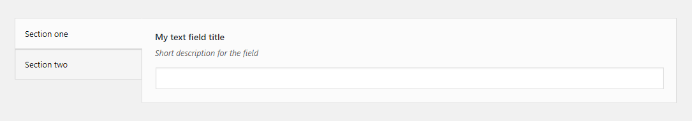

# Sections Field

Sections field groups the fields into togglable sections. This field type is just for stylistic purposes, it means that it can be introduced later without breaking the existing fields.
 
## Example configuration

```php
array(
    'tab' => 'homepage',
    'type' => 'sections',
    'sections' => array(
        array(
            'title' => 'Section one',
            'options' => array(
                array(
                    'title' => 'My text field title',
                    'id' => 'text-option',
                    'desc' => 'Short description for the field',
                    'tab' => 'main',
                    'type' => 'text',
                ),
            ),
        ),
        array(
            'title' => 'Section two',
            'options' => array(
                array(
                    'title' => 'My textarea field title',
                    'id' => 'textarea-option',
                    'desc' => 'Short description for the field',
                    'tab' => 'main',
                    'type' => 'textarea',
                ),
            ),
        ),
    ),
),
```

This will produce the following



## Description

Each section in the `sections` array should have the `title` and the `options` array. The `options` should consist of regular fields configurations.

Unlike other grouping fields, such as [Field Group](field-group.md) or [Repeater](repeater.md), where the IDs of the fields in groups could be used multiple times, this type requires that all the options were like regular options with unique IDs.

You won't be able to get all values of a section at once, so strictly speaking, the Sections field is more of a wrapper than a field.

## Params

| Name | Type | Description |
| --- | --- | --- |
| `type` | string | `sections` **(required)**
| `sections` | array | An array of sections, each containing the `title` and `options` keys. See [description](description.md) for more details. **(required)**
| `tab` | string | Specifies in which tab this option will be rendered