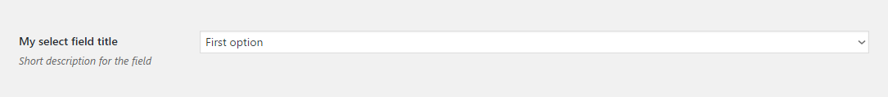
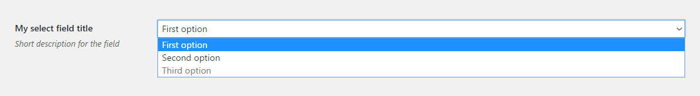
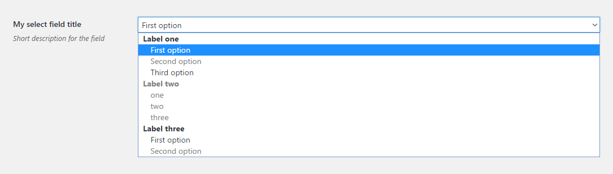

# Select

Select field renders a native select element. Supports [`optgroups`](select.md#optgroups) and [`disabled` attributes](select.md#disabled).

## Example configuration

```php
...
array(
    'title' => 'My select field title',
    'id' => 'select-option',
    'desc' => 'Short description for the field',
    'tab' => 'main',
    'type' => 'select',
    'choices' => ['First option', 'Second option', 'Third option']
),
...
```

This will produce the following



It will use the option text as the value. If you wish to separate values from option texts use the following syntax for the `choices` key:

```php
...
'choices' => array(
    array(
        'value' => 'First value',
        'label' => 'First option',
    ),
    array(
        'value' => 'Second value',
        'label' => 'Second option',
    ),
    array(
        'value' => 'Third value',
        'label' => 'Third option',
    ),
)
...
```

## `disabled`

If `disabled` keys are specified, they'll be respected. E.g:

```php
...
'choices' => array(
    array(
        'value' => 'First value',
        'label' => 'First option',
    ),
    array(
        'value' => 'Second value',
        'label' => 'Second option',
    ),
    array(
        'value' => 'Third value',
        'label' => 'Third option',
        'disabled' => true,
    ),
)
...
```

will result in the following



Notice that the third option is not selectable.

## `optgroups`

You can create complex select elements with `optgroups`. To do that, use the `optgroups` key instead of `choices`. Each `optgroup` has the following signature:

```php
array(
    'label' => 'Label text',
    'choices' => array(),
),
```

where `label` will store the text for the `label` attribute and `choices` is an array of options like in the example configuration.

The following configuration

```php
...
'optgroups' => array(
    array(
        'label' => 'Label one',
        'choices' => array(
            array(
                'value' => 'Label one first',
                'label' => 'First option',
            ),
            array(
                'value' => 'Label one second',
                'label' => 'Second option',
                'disabled' => true,
            ),
            array(
                'value' => 'Label one third',
                'label' => 'Third option',
            ),
        ),
    ),
    array(
        'label' => 'Label two',
        'disabled' => true,
        'choices' => ['one', 'two', 'three'],
    ),
    array(
        'label' => 'Label three',
        'choices' => array(
            array(
                'value' => 'Label three first',
                'label' => 'First option',
            ),
            array(
                'value' => 'Label three first',
                'label' => 'Second option',
                'disabled' => true,
            ),
        ),
    ),
),
...
```

will result in the following



Note that the whole second `optgroup` is disabled because the `disabled` key is specified for the `optgoup` itself, not like individual `disabled` keys in groups 1 and 3.

## Params

| Name | Type | Description |
| :--- | :--- | :--- |
| `type` | string | `select` **\(required\)** |
| `id` | string | Unique ID that will be used to retrieve the value **\(required\)** |
| `tab` | string | Specifies in which tab this option will be rendered |
| `title` | string | Shows a heading to the left of the field |
| `desc` | string | Shows a description text \(can have HTML\) |
| `choices` | array | Can be an array of strings or an array of arrays with `value` and `label` keys. See [examples](select.md#example-configuration) above. |
| `optgroups` | array | Array of arrays with `label` and `choices` keys. See [`optgroups`](select.md#optgroups) above. |

