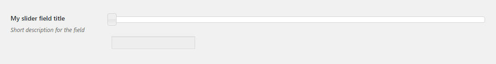

# Slider Field

Slider field renders a standard [jQuery UI Slider](https://jqueryui.com/slider/) with a readonly input.

## Description

The `values` key specifies 3 parameters: `min`, `max` and `step`. If any (or all) keys are missing, but the `values` key is provided, they will default to the following

```php
...
'values' => array(
    'min' => 0,
    'max' => 100,
    'step' => 1,
),
...
```
 
## Example configuration

```php
...
array(
    'title' => 'My slider field title',
    'id' => 'slider-option',
    'desc' => 'Short description for the field',
    'tab' => 'main',
    'type' => 'slider',
    'values' => array(
        'min' => 0,
        'max' => 200,
        'step' => 5,
    ),
),
...
```

This will produce the following



## Params

| Name | Type | Description |
| --- | --- | --- |
| `type` | string | `slider` **(required)**
| `id` | string | Unique ID that will be used to retrieve the value **(required)**
| `values` | array | Array containing `min`, `max` and `step` keys. See [Description](#description) above for the default values. **(required)**
| `tab` | string | Specifies in which tab this option will be rendered
| `title` | string | Shows a heading to the left of the field
| `desc` | string | Shows a description text (can have HTML)