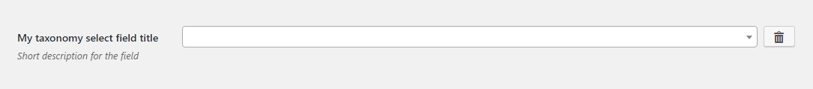
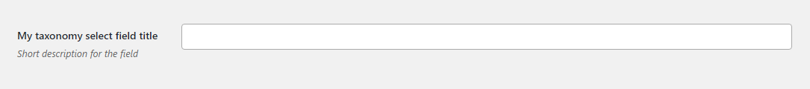

# Taxonomy Select Field

Taxonomy select field renders a searchable [Select 2](https://select2.github.io/) field. Similar to the [Datalist](datalist.md) field. Supports [multiple choice](#multiple-choice).

## Example configuration

```php
...
array(
    'title' => 'My taxonomy select field title',
    'id' => 'taxonomy-select-option',
    'desc' => 'Short description for the field',
    'tab' => 'main',
    'taxonomy' => 'category',
    'type' => 'taxonomy-select',
),
...
```

This will produce the following



## Multiple choice

if `'multiple' => true` is added to the [configuration object](#example-configuration), the field will respect it. The following configuration

```php
...
array(
    'title' => 'My taxonomy select field title',
    'id' => 'taxonomy-select-option',
    'desc' => 'Short description for the field',
    'tab' => 'main',
    'taxonomy' => 'category',
    'multiple' => true,
    'type' => 'taxonomy-select',
),
...
```

will result in the following



## Params

| Name | Type | Description |
| --- | --- | --- |
| `type` | string | `taxonomy-select` **(required)**
| `id` | string | Unique ID that will be used to retrieve the value **(required)**
| `tab` | string | Specifies in which tab this option will be rendered
| `title` | string | Shows a heading to the left of the field
| `desc` | string | Shows a description text (can have HTML)
| `multiple` | boolean | Set to `true` if multiple values are needed. See [an example](#multiple-choice) above.
| `taxonomy` | string | Taxonomy (standard or custom) to search the terms in. If not specified, searches in the `category` taxonomy.