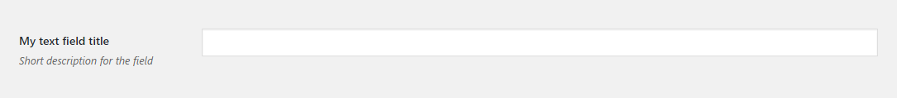

# Text

Text field renders a simple text input.

## Example configuration

```php
...
array(
    'title' => 'My text field title',
    'id' => 'text-option',
    'desc' => 'Short description for the field',
    'tab' => 'main',
    'type' => 'text',
),
...
```

This will produce the following



## Params

| Name | Type | Description |
| :--- | :--- | :--- |
| `type` | string | `text` **\(required\)** |
| `id` | string | Unique ID that will be used to retrieve the value **\(required\)** |
| `tab` | string | Specifies in which tab this option will be rendered |
| `title` | string | Shows a heading to the left of the field |
| `desc` | string | Shows a description text \(can have HTML\) |

